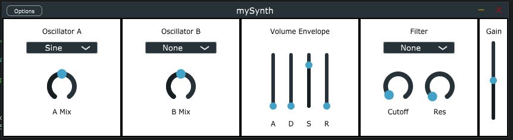

# mySynth
Synth made using JUCE framework  

FEATURES:  
* Two Oscillators (each with mix and variable waveform)
* Volume envelope
* Variable filter (with variable cutoff and resonacne)
* Overall gain slider 
 

